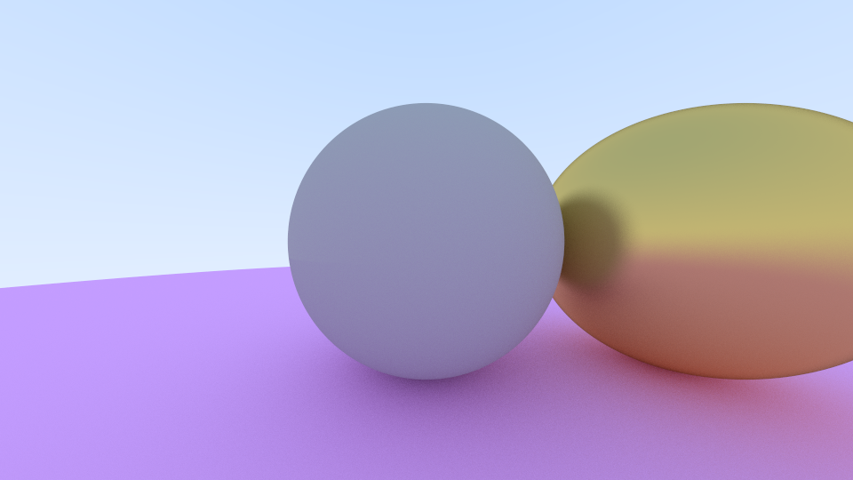

# Raytracing In One Weekend - Rust Implementation

---

## Features
* Diffuse/Metallic/Dielectric materials
* Multithreading - Rendering time scales roughly inverse to number of CPU cores
    * 640x320 image, 1k samples - i7-8550U CPU @ 1.80GHz (4 cores / 8 threads)
    * Sequential time: 26.5s
    * Parallel time: 5.8s
    * ~4.57x speedup
